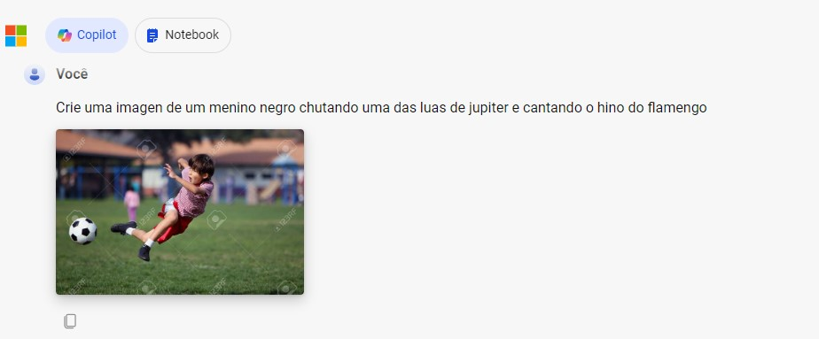
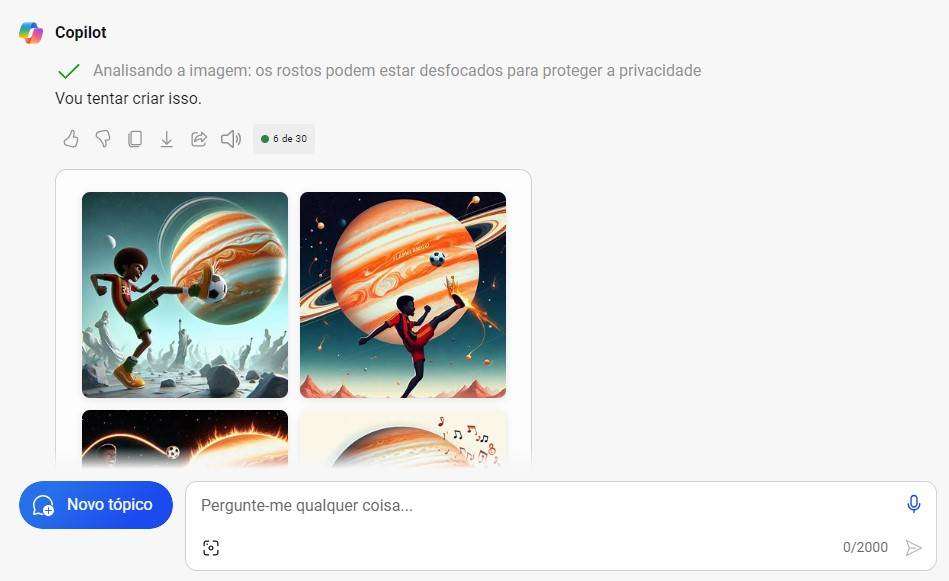
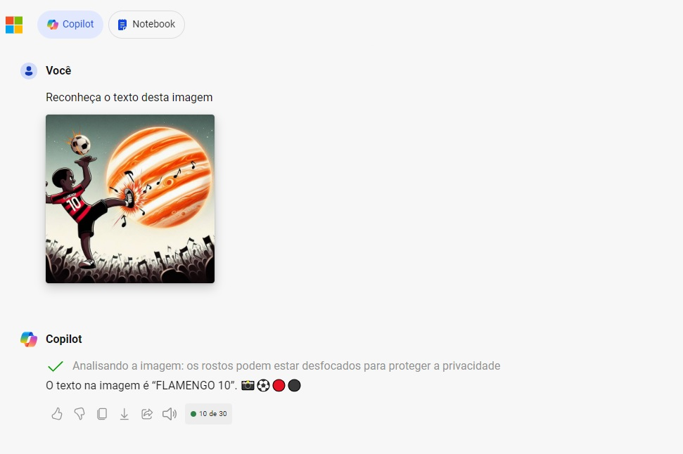

# dio-lab-ia-generativa

O **Estúdio de IA do Azure** é um hub de desenvolvimento de **IA generativa** que oferece uma plataforma completa para criar, avaliar e implantar soluções de IA. Aqui estão alguns destaques:

1. **Criação Personalizada**: O Estúdio de IA do Azure permite que você crie **modelos de IA personalizados** para atender às suas necessidades específicas. Você pode desenvolver copilotos, chatbots, geradores de texto e muito mais.

2. **Avaliação e Experimentação**: Teste e avalie seus modelos de IA com facilidade. O Estúdio de IA do Azure oferece ferramentas para medir o desempenho, ajustar hiperparâmetros e otimizar seus modelos.

3. **Implantação Simplificada**: Implante suas soluções de IA generativa em produção com confiança. O Estúdio de IA do Azure facilita a implantação em escala, monitoramento e gerenciamento contínuo.

4. **Integração com Serviços de Nuvem**: Integre seus modelos de IA com outros serviços do Azure, como armazenamento, bancos de dados e fluxos de trabalho.

5. **Segurança e Conformidade**: O Estúdio de IA do Azure oferece segurança integrada e conformidade com padrões de segurança cibernética. A Microsoft investe bilhões em segurança e possui especialistas em segurança e inteligência cibernética.

6. **Experiências de Cliente Aprimoradas**: Use a IA generativa para melhorar a qualidade do trabalho, reduzir riscos organizacionais e aprimorar a produtividade.

Para saber mais sobre o **Estúdio de IA do Azure**, visite a [página oficial](https://azure.microsoft.com/pt-br/products/ai-studio/) e comece sua jornada de IA hoje mesmo! 🚀🤖

- Criando uma imagem.
  

- Resultado apresentado.
  

- Analisando e extraindo o texto.
  

  1. Entre MS Copilot
  2. Submeta uma imagem de exemplo do que deseja criar
  3. Descreva o que deseja. Ex.: "Crie uma imagen de um menino negro chutando uma das luas de jupiter e com a camisa do flamengo"
  4. Pegue a imagem de resultado...
  5. Faça o upload desta imagem e peça: "Reconheça o texto desta imagem"
  6. Verifique o resultado